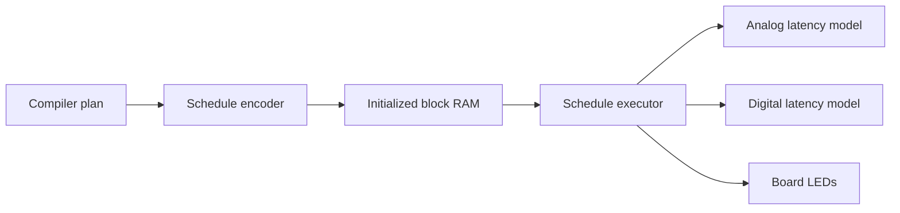

# FPGA Architecture

The FPGA prototype executes the same 32-bit schedule format as
`heterocore-rtl`. Until a physical analog array is attached, the analog and
digital engines are deterministic latency models. Their purpose is to verify
control flow, schedule ordering, completion, and board integration.

## Arty A7 Controls

| Control | Function |
| --- | --- |
| BTN0 | synchronous reset |
| BTN1 | start schedule |
| LED0 | executor busy |
| LED1 | one-cycle completion pulse |
| LED2 | current target: analog=1 |
| LED3 | heartbeat |

The checked-in XDC uses Digilent's Arty A7-35T master pin assignments.

